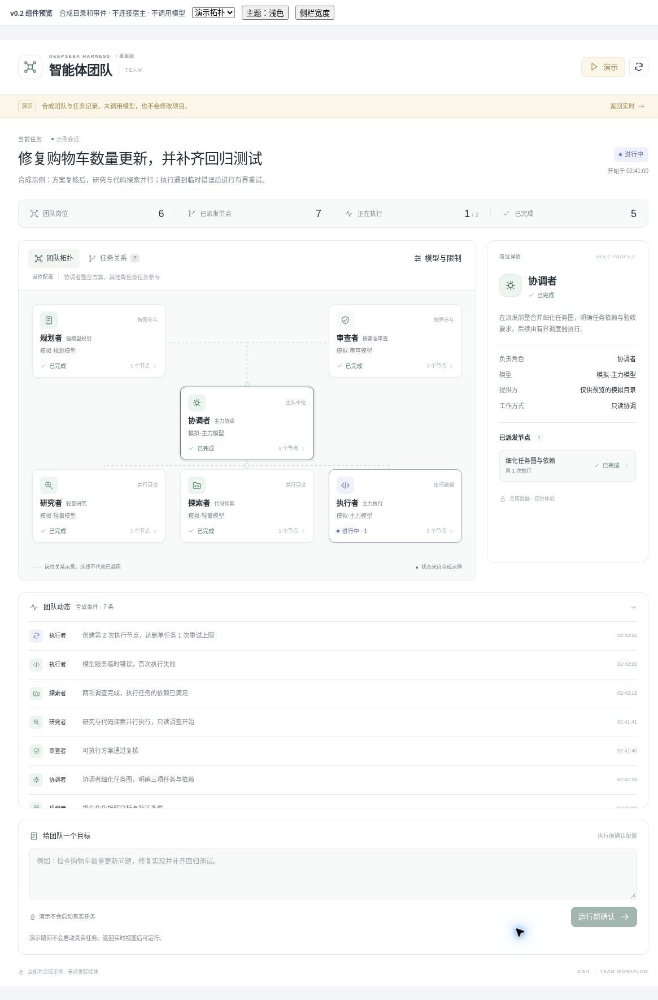

# DSH Desktop · 多模型团队

**v0.2.0：真正绑定宿主模型的多岗位编排，而不只是状态查看器。**

面向官方 DeepSeek Harness Desktop **0.2.0-rc.2** Web Client 接口的独立插件。在原生右侧栏打开「多模型团队」，为规划、协调、研究、探索、执行和复核岗位分别选择已配置模型。界面以团队拓扑为主，也可查看由实际控制器事件生成的任务 DAG。



图片是同一组件的明确标识演示。没有调用模型，也不代表已在用户的 Windows/Electron 发行版安装成功。

## 岗位如何真正协作

1. **规划模型**输出受严格校验的任务 DAG。
2. **协调模型**实际调用一次，对 DAG 分工和依赖做调整；它不是确定性调度器的虚假模型标签。
3. 开启方案复核时，**复核模型审查协调者最终的可执行方案**，通过后才派发任务。
4. **研究、探索**任务可并行；**执行岗位**在当前项目中串行工作。依赖完成后，确定性调度器才能启动后继任务。
5. 失败重试产生独立版本节点；重复失败交给复核诊断后停止。权限拒绝不自动重试。最终复核未通过时显示反馈，不伪造完成或自动进入无限修复循环。

每次派发都把岗位所选的 provider/model/reasoningEffort/maxTokens 传给真实 `ctx.subagents.start('spawn', …)`。可选路由岗位同样使用所选宿主模型；不会冒充一个未配置的 Jev API。Sol、Luna、Astra 等参考帖名称不是硬编码的可用模型 ID。

## 执行边界

- **安装、打开面板、切换演示、读取模型目录都不会调用推理模型。** 只有在真实主会话中填写目标、检查模型/推理强度/限制/工作目录，并点击「确认并启动团队」后才执行。
- 模型只能来自当前宿主已注册目录，启动时再次验证。目录存在不保证密钥有效；插件不读取、保存或传输模型密钥。
- 任务目标和工具读取的项目上下文会发送给所选模型提供方。请选择适合该项目的数据处理范围的提供方。
- 规划、协调、研究、探索、复核岗位有实际工具执行白名单；写入、Shell、递归代理和权限变更工具不在只读岗位白名单。执行岗位仅使用明确列出的原生读写/Shell 工具，仍受宿主原有权限约束。
- **不提升权限、不改 sandbox、不自动审批。** rc.2 子代理需要额外批准时会被宿主拒绝，而不是弹出可由本插件批准的窗口。受阻时回到主会话处理。
- 默认同时只运行一个团队，避免跨会话共享工作区写入冲突。当前主会话的修改工具暂停至团队子代理清理完成。外部编辑器或本插件之外的宿主任务不具备事务隔离。
- 限制包括总派发数、并发数、任务数、重试、时长、每个子代理的步骤和**每次模型请求输出上限**。这些不是人民币/美元预算，也不是总 token 消耗保证；宿主内部重试可能增加费用。
- 停止会取消本次运行并等待清理，**不会回滚已经产生的文件修改**。如果无法确认清理完成，会锁定后续运行并提示检查残留任务、重启宿主，绝不宣称已经停止。
- 运行记录在插件进程内保留且有容量上限；插件卸载/重载会尝试取消并清理，不能跨进程自动续跑。子代理会话由宿主管理。

## 构建与安装

需要 Node 22.19+ 或 24+：

```sh
npm ci --ignore-scripts
npm run check
npm pack --ignore-scripts
```

使用已有且确实属于 Desktop 的 profile。先退出 Desktop，再运行：

```sh
dsh plugin --profile YOUR_DESKTOP_PROFILE add /absolute/path/dsh-desktop-workflow-0.2.0.tgz --ignore-scripts
```

重启 Desktop，打开**已有的真实主会话**，从右侧栏新增入口选择「多模型团队」。无会话、会话正忙、所需宿主服务缺失或权限上下文无法验证时，启动按钮会禁用。模型配置仅在该浏览器/应用来源的本地存储中保存模型引用与运行限制，不保存密钥、目标或项目证据。

详见 [中文安装说明](docs/INSTALL.zh-CN.md)。`dist/` 中保留 v0.1 历史包与 v0.2 包，`SHA256SUMS` 可校验；新安装使用 v0.2。

## 卸载

```sh
dsh plugin --profile YOUR_DESKTOP_PROFILE remove dsh-desktop-workflow --config.ignore-scripts=true
```

重启 Desktop。若你给旧状态导入添加过 `desktop-workflow` 的 profile 配置，仅移除那段自己添加的覆盖项。原项目与生产端状态文件不会由卸载过程删除。

## 保留的 v0.1 功能

「导入旧状态」是次级只读视图，可查看原 `CliWorkflowStore` 保存的 JSON。它与当前真实团队运行无关，也不绑定当前聊天；需要显式配置绝对 `stateFile`。旧的固定阶段图不再是产品主界面。

## 验证与诚实边界

- 构建、类型检查、调度器、真实适配器的确定性契约测试、会话隔离、清理锁、UI 交互测试均可用 `npm run check` 重现。
- 可选真实 rc.2 宿主测试：`DSH_NODE_MODULES=/path/to/node_modules npm run test:host` 和 `npm run test:team-host`。
- 测过真实认证、原生 Loader/客户端资源、工具执行保护和 schema；推理执行使用明确的确定性桩，**没有付费模型或完整真实 AgentLoop 端到端运行**。
- `npm run preview` 是本地纯组件预览，目录/事件均为合成数据，确认按钮明确拒绝真实执行。

详见 [架构](docs/ARCHITECTURE.md) 与 [验证记录](docs/VERIFICATION.md)。具体 Windows/Electron 发行版、实际模型账号和真实项目任务仍需要在目标环境验证。
