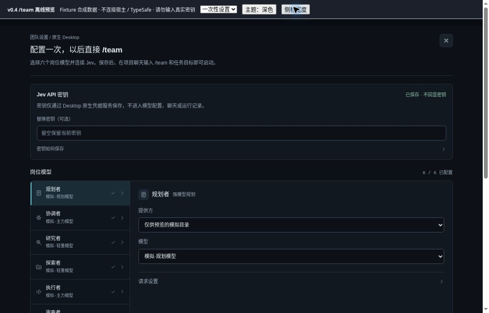
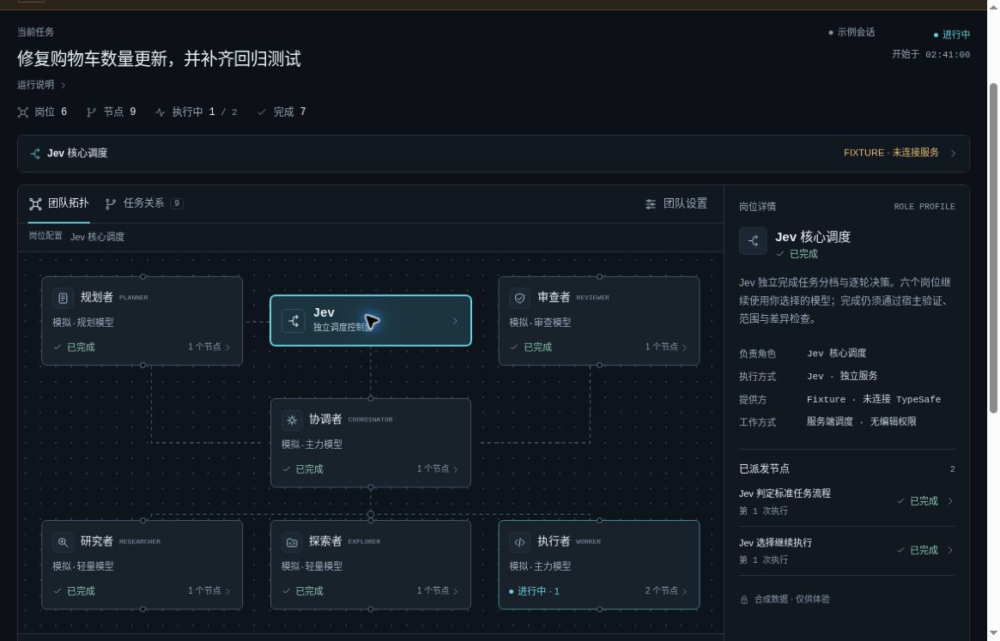
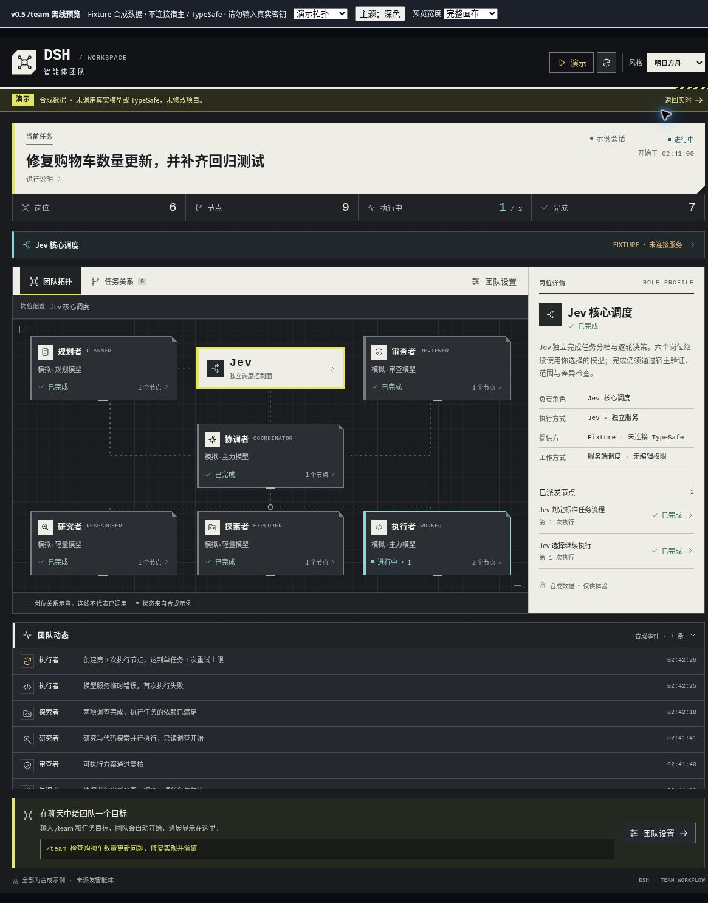
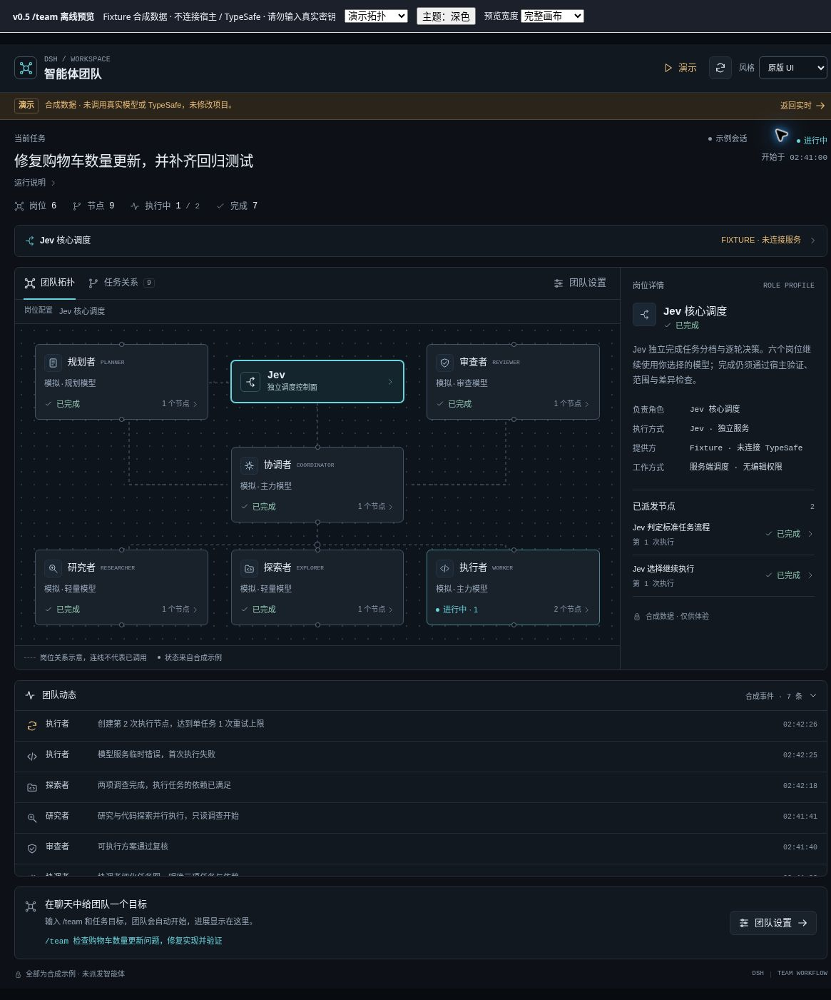

# v0.4 云端验收记录

日期：2026-10-09。本文将实际使用官方宿主的接口验收、合成数据界面检查、真实模型调用区分记录。

## 已验证

- 官方 rc.2 附件链路：安全测试包写入 LocalAttachmentStore，生成可向模型呈现的只读绝对路径；该精确路径交给官方 plugin_manager 后可安装、登记及卸载。拒绝批准时不会安装。此项没有让模型理解自然语言指令。
- 官方设置与凭据：ConfigEditor / SettingsForms / Loader 的实际持久化、旧版本冲突拒绝、宿主重建后恢复；凭据用随机假值验证写入、0600 文件权限、配置状态回读及删除。普通设置与工作流快照不含假密钥值。
- 官方命令接口：实际注册 `/team`，通过宿主认证 HTTP 命令入口验证缺配置、重复提交、会话隔离、取消和预检中取消。模型传输、子代理产出和部分验证事实使用明确测试替身。
- 实际项目检查：隔离临时仓库可在已有未提交修改和大型 ignored 依赖目录下建立基线并运行 Node 检查；测试路径与全跳过测试等回归由独立审查覆盖。具体当前自动检查能力见版本说明。
- 组件浏览器检查：云电脑本地 `4173` 离线预览；六岗位与 Jev 表单、假密钥提交后输入清空、长期同意撤销后显示需配置、关闭重开、浅色/深色及窄栏检查。修复全宽设置页横向溢出。预览不连接宿主或 TypeSafe，不保存真实密钥。

## 科技风改版复验

改版后重新检查宽画布与 420px 窄栏、Jev 节点详情、任务图适应缩放、窄栏查看详情/返回图谱、逐岗位编辑和假密钥保存清空。截图为最终离线组件，不是宿主或真实模型运行。独立完整回归为 138/138 项通过，无跳过；14 个后端源文件与功能基线逐字节一致。

最终构建、类型检查和测试数量以 [验证记录](VERIFICATION.md) 为准；更新实现后的最后一次完整回归才是交付依据。

## 尚未验证

- 用户在 Windows/Electron DSH 中实际拖包、让真实模型选择插件管理工具并完成安装的全流程。
- v0.4 设置页与右栏在真实 Electron 宿主中的视觉表现。
- 使用真实 Jev Key、TypeSafe 服务和六岗位付费模型完成实际开发任务。未进行这些调用，也未配置用户真实凭据。

## 历史情况

v0.2 曾在云端官方 DSH Web 宿主显示右侧插件。v0.3 隔离宿主完成安装启动，但该地址被云浏览器屏蔽，未作为真实界面验收通过；没有绕过该限制。这些历史结果不代替 v0.4 的 GUI 端到端验证。

## v0.5 双风格复验

- 右上角在「明日方舟 / 原版 UI」间切换；刷新后仍保留已选风格。
- 完整画布、420px 与 320px 的两种风格无根容器横向溢出。
- 键盘切换保留选中任务与 75% 图谱缩放；模型草稿在切换后保留。
- 处理了浅色任务栏运行状态文字对比度、深色选中标签焦点对比度问题。
- 最终独立和主任务完整检查均为 151/151，通过且无跳过。14 个后端源文件未修改。
- 凭据草稿、挂起保存/取消、多挂载同步、存储不可用等由自动化回归覆盖；真实密钥未输入。

上述是组件视觉与接口回归，不替代 Windows/Electron 或真实模型调用的端到端验收。
